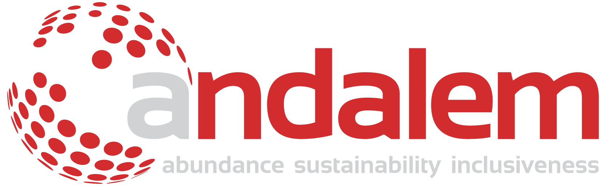

#

# Welcome to Andalem PLC

## About Us

Andalem Consulting PLC is an Addis Ababa-based research and advisory firm dedicated to advancing Ethiopia’s and Africa’s economic transformation through Artificial Intelligence and digital innovation. We strive to engineer abundance, sustainability, and inclusiveness, offering tailored AI solutions and fostering an environment where technology and tradition converge to create a sustainable future.

## Our Services

We specialize in:
- **Artificial Intelligence**: Developing robust AI strategies and custom solutions that align with business and societal needs.
- **Consortium Projects**: Managing and executing large-scale projects that leverage the power of collaboration across various sectors.
- **Advanced Research**: Driving innovation with deep dives into emerging technologies and trends.

## Projects

Our projects range from digital transformations in education and public sector efficiencies to creating frameworks for technological R&D across Africa. Check our [Projects](https://andalem.com/projects/) section for more details.

## Installation

Clone this repository to get started with our open-source projects.

## Contributing

We welcome contributions from the community. Please feel free to contact us for information on how to get started.

## Contact

Reach out to us at:
- **Email**: [contact@andalem.com](mailto:contact@andalem.com)
- **Phone**: [+251 94 414 5240](tel:+251944145240)
- **Address**: Bole KK Woreda 07 House No 21449, Addis Ababa, Ethiopia

For more information, please visit our [website](https://andalem.com)
